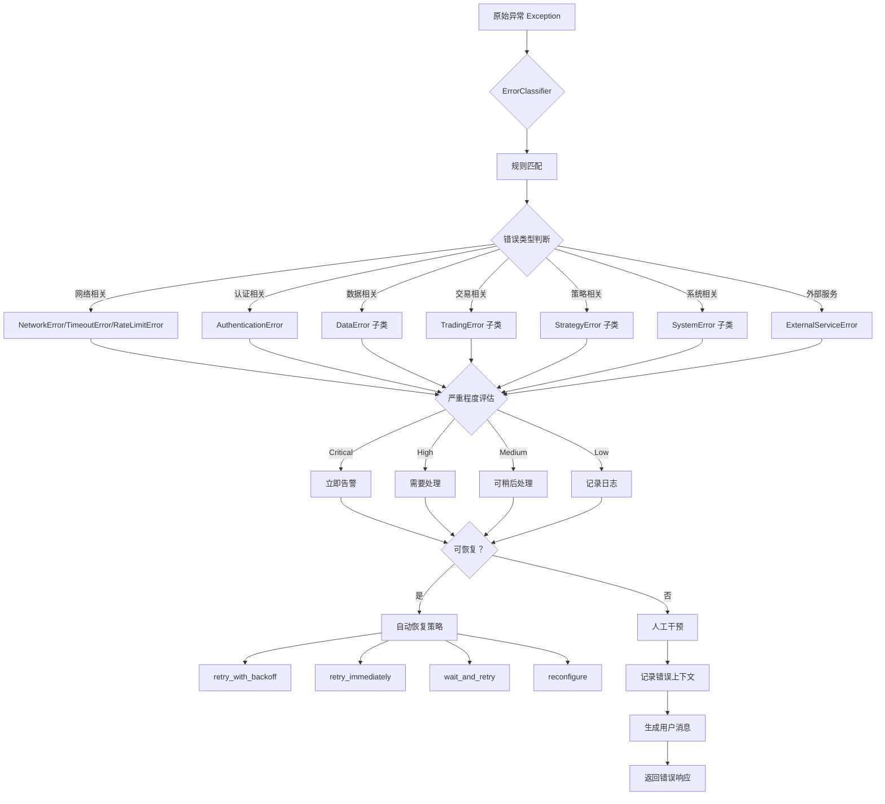
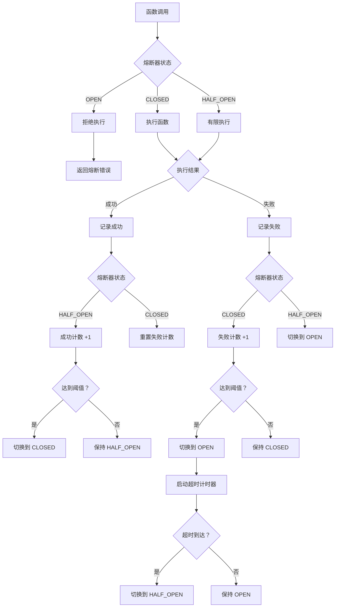
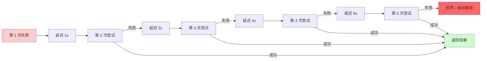
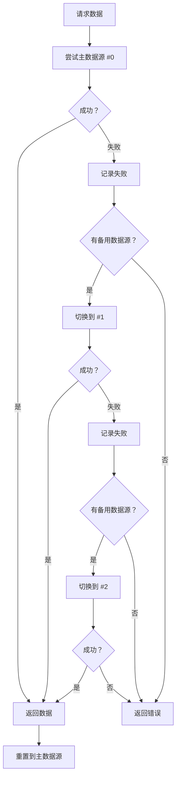
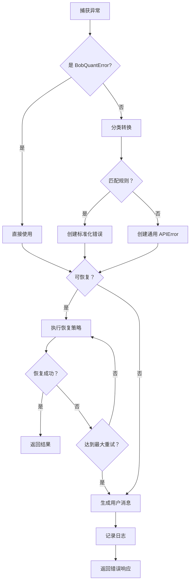
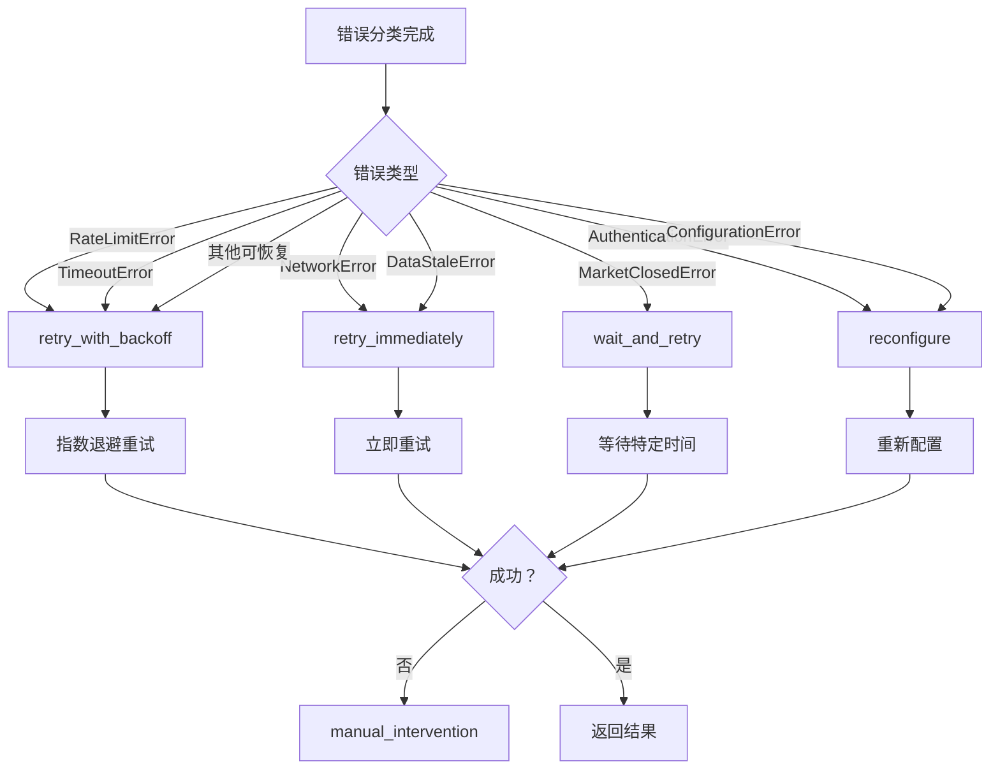
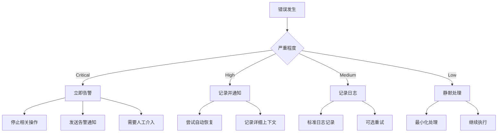
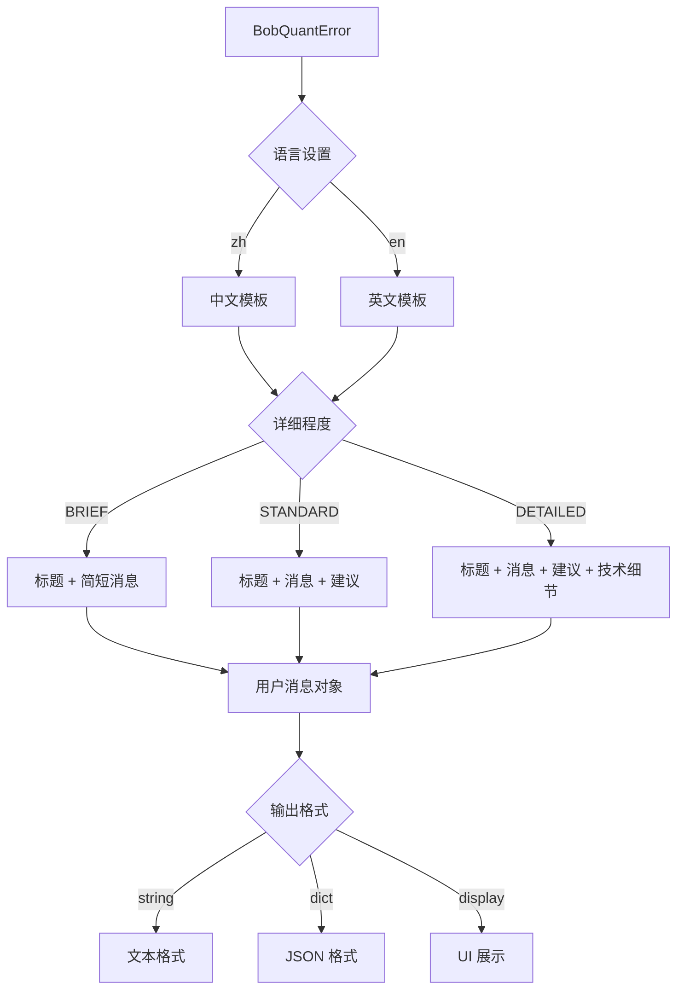

# BobQuant 错误分类与处理流程图

## 📊 错误分类流程



## 🔄 错误恢复流程



## 📉 重试退避策略



## 🔄 数据源故障转移流程



## 🎯 错误处理决策树



## 📋 错误类型层次结构

```
BobQuantError (基类)
│
├── APIError
│   ├── NetworkError
│   ├── TimeoutError
│   ├── RateLimitError
│   └── AuthenticationError
│
├── DataError
│   ├── DataNotFoundError
│   ├── DataFormatError
│   ├── DataValidationError
│   └── DataStaleError
│
├── TradingError
│   ├── OrderError
│   │   └── OrderRejectedError
│   ├── InsufficientFundsError
│   ├── PositionError
│   └── MarketClosedError
│
├── StrategyError
│   ├── SignalError
│   ├── ConfigurationError
│   └── BacktestError
│
├── SystemError
│   ├── FileSystemError
│   ├── DatabaseError
│   └── MemoryError
│
└── ExternalServiceError
    └── ThirdPartyAPIError
```

## 🔧 恢复策略选择



## 📊 错误严重程度处理



## 🎯 用户消息生成流程



## 📈 统计与监控

系统自动跟踪以下指标：

```
错误统计
├── 按分类统计 (by_category)
│   ├── network: 15
│   ├── data: 8
│   ├── trading: 3
│   └── system: 1
│
├── 按严重程度统计 (by_severity)
│   ├── critical: 2
│   ├── high: 10
│   ├── medium: 12
│   └── low: 3
│
├── 可恢复性统计
│   ├── recoverable: 20
│   └── non_recoverable: 7
│
└── 恢复成功率
    ├── retry_success_rate: 85%
    ├── fallback_success_rate: 92%
    └── circuit_breaker_trips: 3
```

---

**文档版本**: v1.0  
**最后更新**: 2026-04-11  
**灵感来源**: Claude Code 错误处理系统
